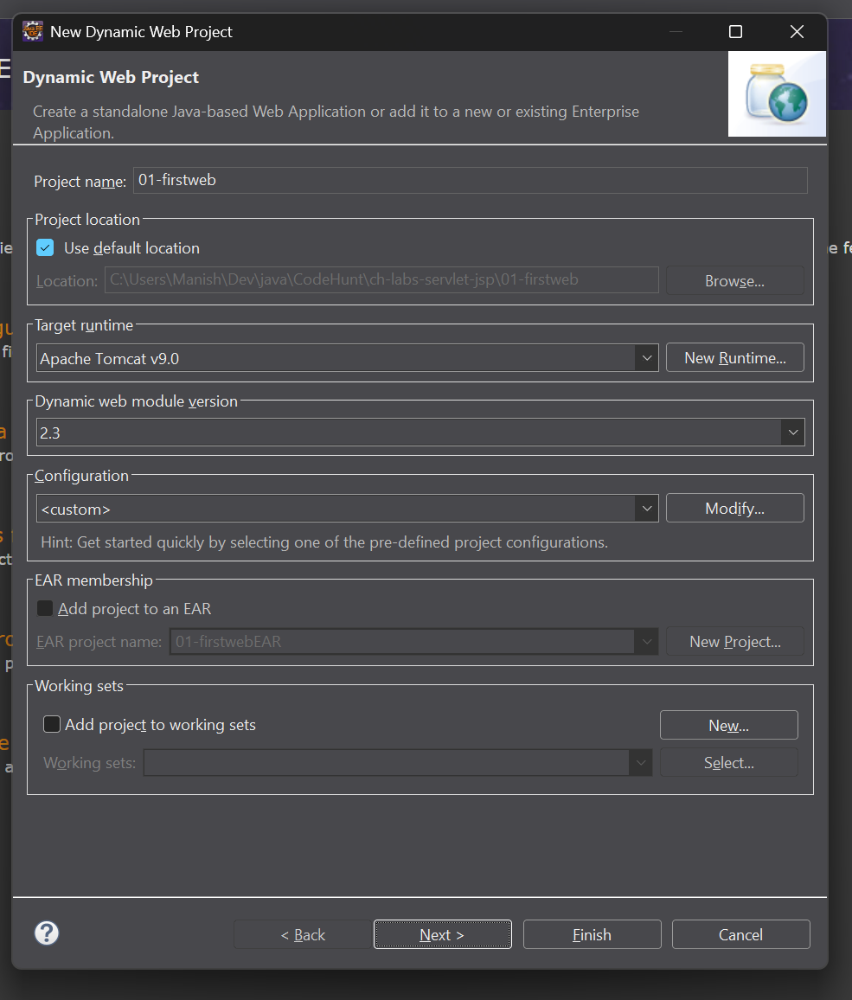
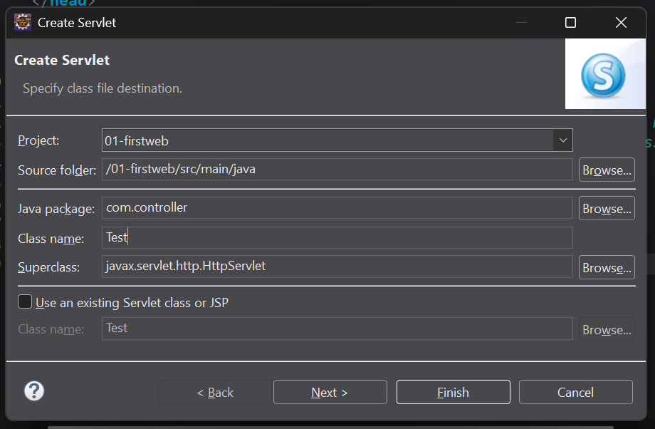
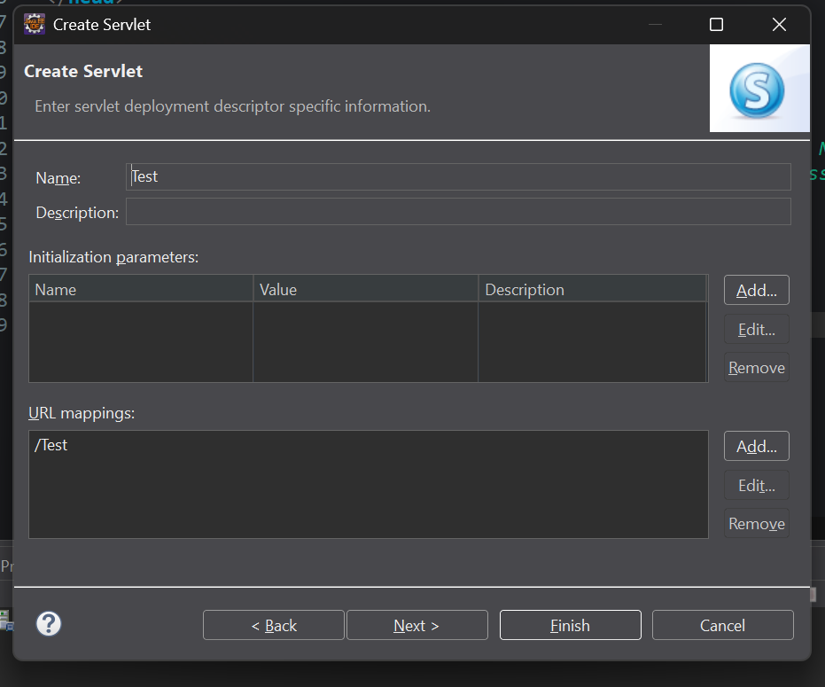
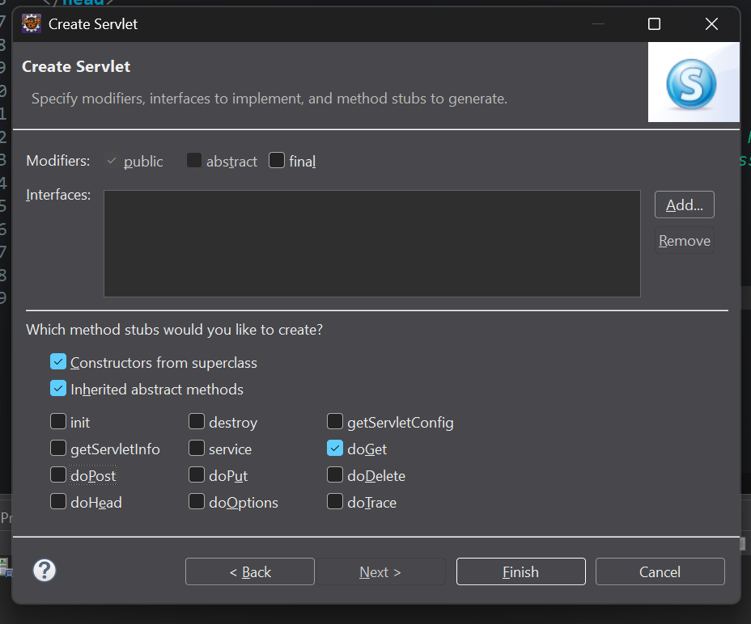
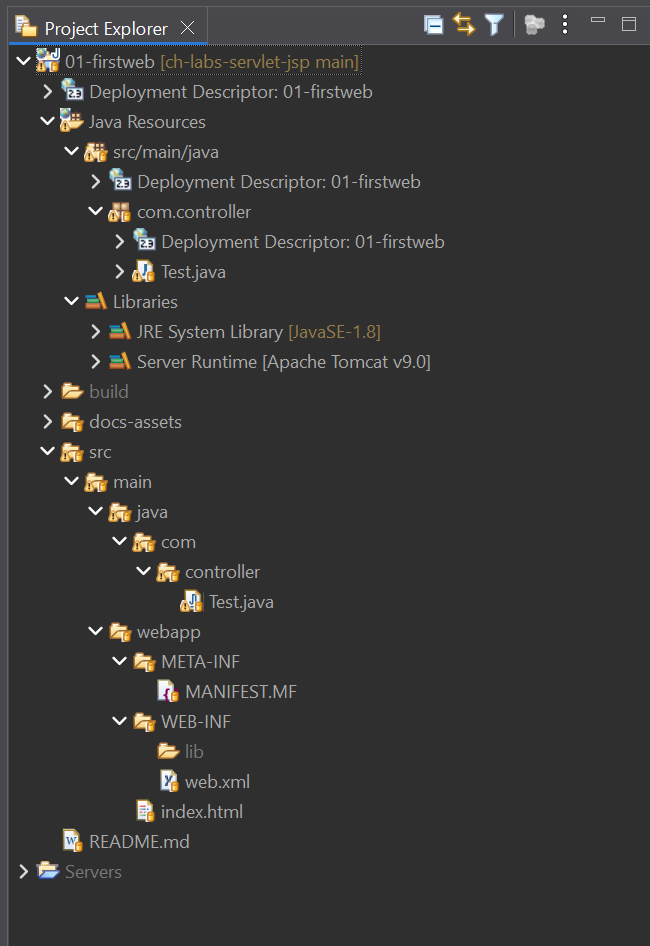
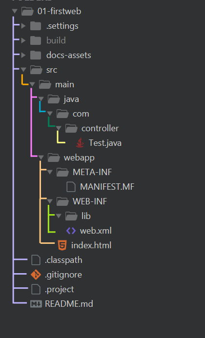

# Create First Dynamic Web Project

Steps:
1. File -> New -> Dynamic Web Project
1. "New Dynamic Web Project" wizard dialog windows opens up.
1. Project Name: "01-firstweb"
1. Confirm Target runtime is set to Apache Tomcat v9.0 (which we have already
    setup on Eclipse)
1. Set value of Dynamic web module version to **2.3** (this is for XML support).
    Version 3.0 onwards, XML support is removed in favour of annotations.
    With XML, we get access to web.xml (which is the Deployment Descriptor file)
    in which we can learn how to manually do the URL-Servlet mappings etc.
    In newer versions of Dynamic web module (Version 3.0 onwards), we only get
    support for annotation based URL mappings - which is a simpler way & the
    modern way. But it is better to stick to web.xml for initial learning phase.

<table align="center" border="1" cellpadding="8">
  <tr>
    <td align="center">
      
       
      <em>Figure: New Dynamic Web Project Wizard Dialog</em>
    </td>
  </tr>
</table>

# Create a "Test" Servlet

1. File -> New -> Servlet
1. Create Servlet wizard dialog window opens up.
1. Wizard screen 1:
    1. Enter Java package as "com.controller" or any name
    1. Enter Class name as "Test"
    1. Hit Next
1. Wizard screen 2: Leave defaults, and hit Next.
1. Wizard screen 3: Leave defaults, uncheck doPost, leave doGet checked.
1. Hit Finish.

<table align="center" border="1" cellpadding="8">
  <tr>
    <td align="center">
      
       
      <em>Figure: Create Servlet wizard dialog - Screen 1</em>
    </td>
  </tr>
  <tr>
    <td align="center">
      
       
      <em>Figure: Create Servlet wizard dialog - Screen 2</em>
    </td>
  </tr>
  <tr>
    <td align="center">
      
       
      <em>Figure: Create Servlet wizard dialog - Screen 3</em>
    </td>
  </tr>
</table>

# Project Directory Structure

Below is directory structure of a (mostly) empty "Dynamic Web Project" created with Eclipse:

Note: We have just one Servlet created as of now in `src/main/java/com.controller.Test`.

<table align="center" border="1" cellpadding="8">
  <tr>
    <td align="center">
      
       
      <em>Figure: Directory Structure of 'Dynamic Web Project' - Eclipse Project Explorer</em>
    </td>
  </tr>
  <tr>
    <td align="center">
      
       
      <em>Figure: Directory Structure of 'Dynamic Web Project' - Raw</em>
    </td>
  </tr>
</table>
