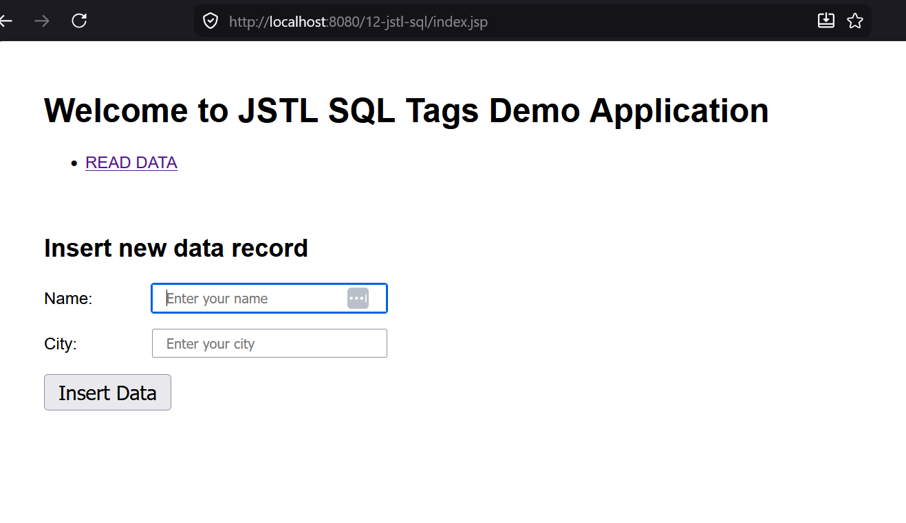
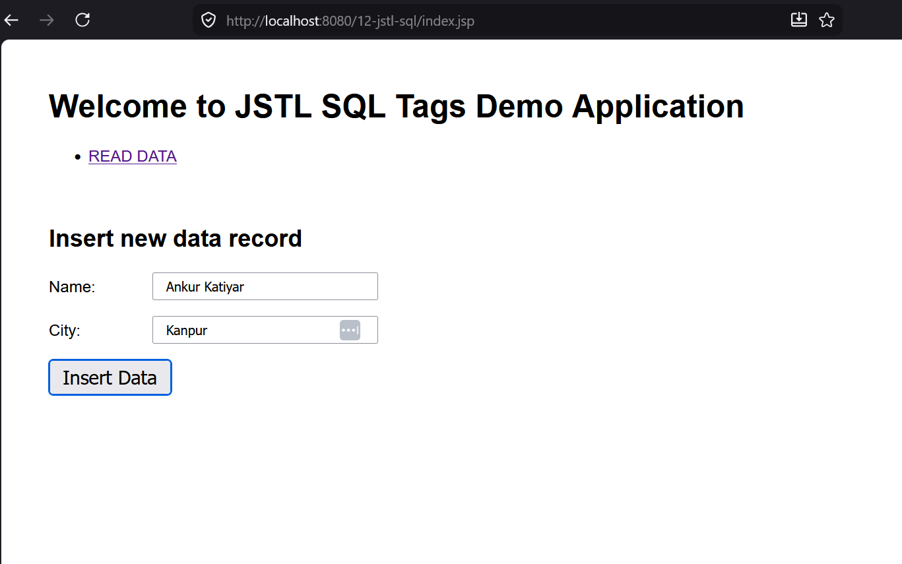
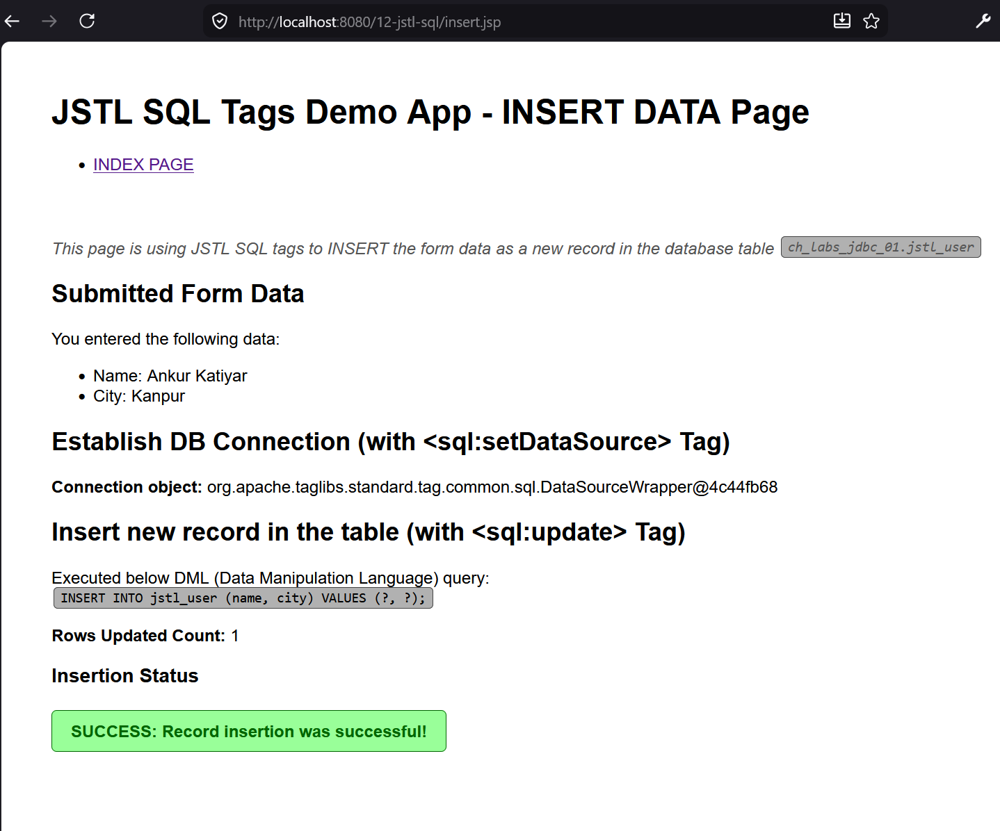
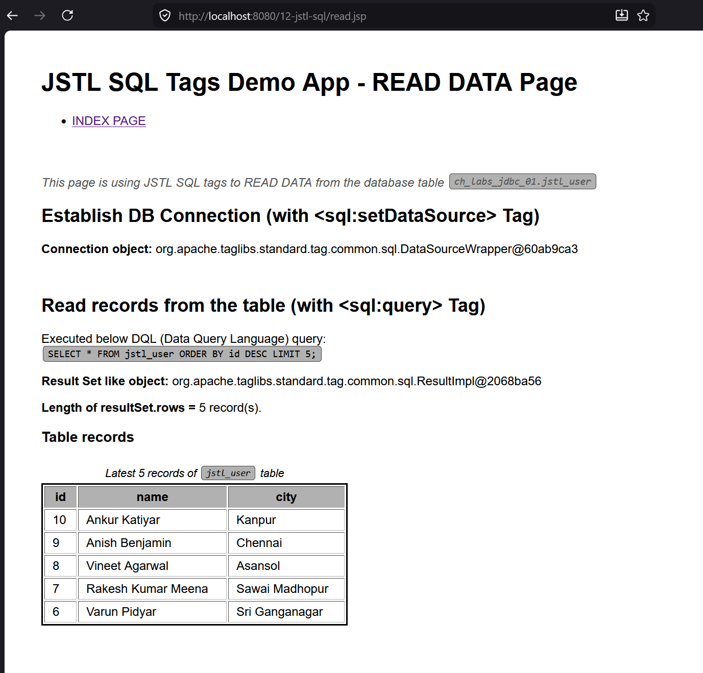

# Project &nbsp; <u>"12-jstl-sql"</u>

Project covers basic usage of <u>**SQL Tags**</u> present under **JSTL**.

Some quick resources about these SQL Tags:
- [https://www.baeldung.com/jstl#sql-tags](https://www.baeldung.com/jstl#sql-tags)
- [https://www.tpointtech.com/jstl-sql-tags](https://www.tpointtech.com/jstl-sql-tags)
- [https://www.geeksforgeeks.org/java/jstl-sql-tags/](https://www.geeksforgeeks.org/java/jstl-sql-tags/)

## Add JARs to WEB-INF/lib/

Copy & paste the below two JAR files in the `src/main/webapp/WEB-INF/lib/`
directory of this project:

1. **mysql-connector-j-8.2.0.jar** JAR File:
   
   Get it from [com.mysql/mysql-connector-j/8.2.0](https://mvnrepository.com/artifact/com.mysql/mysql-connector-j/8.2.0) link on mvnrepository.com

1. **jstl-1.2.jar** JAR File
   
   Get it from [javax.servlet/jstl/1.2](https://mvnrepository.com/artifact/javax.servlet/jstl/1.2)
   link on mvnrepository.com


### Link the sources JAR for these JARs

1. After pasting, right-click your project in Project Explorer and select
   Refresh.
1. Under **Java Resources** -> **Libraries** -> **Web App Libraries**, both the
   added JARs must be present.
1. Eclipse automatically creates this virtual location **Web App Libraries**,
   and makes your JARs (that were pasted inside `WEB-INF/lib/`) visible here.
1. One-by-one, right-click each JAR entry here & select **Properties** from the
   context menu.
1. In the left sidebar of the Properties popup, select these options one-by-one:
    - **Javadoc Location** option.
        1. Select the **Javadoc in archive** radio button, then the
           **External file** radio button.
        1. Under **Archive path** option, click Browse button & pick the *javadoc*
           JAR file (like `mysql-connector-j-8.2.0-javadoc.jar`) if you the
           javadoc JAR file is available on mvnrepository.com
        1. Click the **Apply** button, followed by **Apply and Close** button.
    - **Java Source Attachment** option.
        1. Select the **External location** radio button.
        1. Under above option, click **External file** button, which opens file
           browser.
        1. Pick the *sources* JAR file (like `jstl-1.2-sources.jar`).
        1. Click the **Apply** button, followed by **Apply and Close** button.

## DB Table Pre-Creation

We create the below table `jstl_user` for demo purposes of this project, under
the database `ch_labs_jdbc_01`, using the below CREATE TABLE script:

```sql
CREATE TABLE `ch_labs_jdbc_01`.`jstl_user` (
  `id` int NOT NULL AUTO_INCREMENT,
  `name` varchar(100) NOT NULL,
  `city` varchar(100) NOT NULL,
  PRIMARY KEY (`id`)
) ENGINE=InnoDB DEFAULT CHARSET=utf8mb4 COLLATE=utf8mb4_0900_ai_ci;
```

## Demo screenshots

Below are the screenshots of the web-application developed in this project,
taken from Mozilla Firefox web browser.


<table align="center" border="1" cellpadding="8">
  <tr>
    <td align="center">
      
      <br />
      <em>Figure 1: Index Page — Insert New Record Form - Empty</em>
    </td>
  </tr>
  <tr>
    <td align="center">
      
      <br />
      <em>Figure 2: Index Page — Insert New Record Form - Filled</em>
    </td>
  </tr>
  <tr>
    <td align="center">
      
      <br />
      <em>Figure 3: Insert Page — New Record Inserted</em>
    </td>
  </tr>
  <tr>
    <td align="center">
      
      <br />
      <em>Figure 4: Read Page — Show Records</em>
    </td>
  </tr>
</table>

