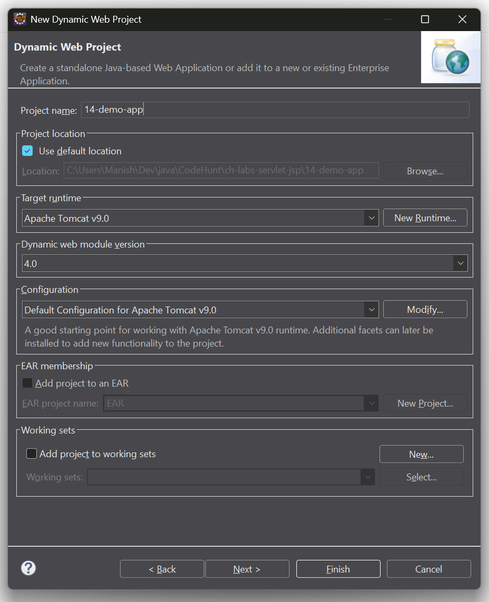
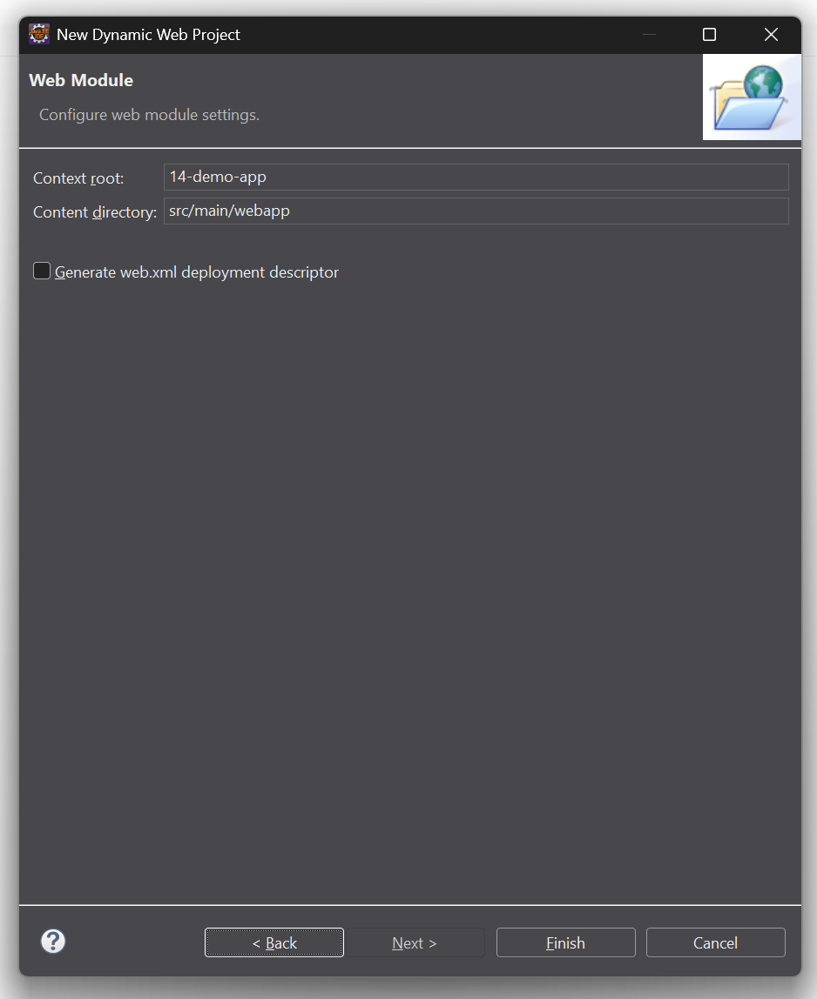
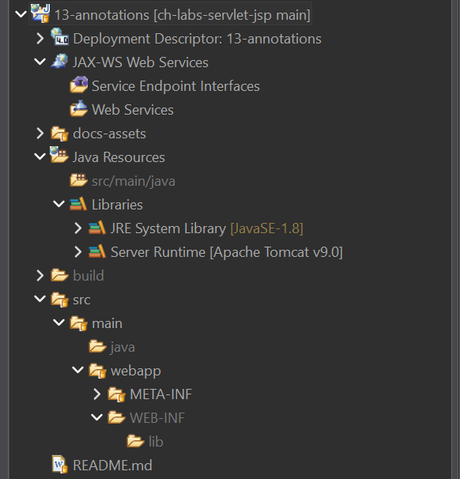

# Project &nbsp;<u>"13-annotations"</u>

## New Project: Dynamic web module version v3.0 Onwards

Below are screenshots when creating a New Dynamic Web Project in Eclipse having
value of *Dynamic web module verion* (or *Servlet API version*) higher than or
equal to *Version 3.0*.

In this project, we picked **Version 4.0**.

<table align="center" border="1" cellpadding="8">
  <tr>
    <td align="center">
      
       
      <em>Figure 1: New Dynamic Web Project wizard — Use Version 4.0"</em>
    </td>
  </tr>
  <tr>
    <td align="center">
      
       
      <em>Figure 2: New Dynamic Web Project wizard — Skip Generating web.xml</em>
    </td>
  </tr>
  <tr>
    <td align="center">
      
       
      <em>Figure 3: Servlet 4.0 Dynamic Web Project — Directory Structure / Project Explorer</em>
    </td>
  </tr>
</table>

